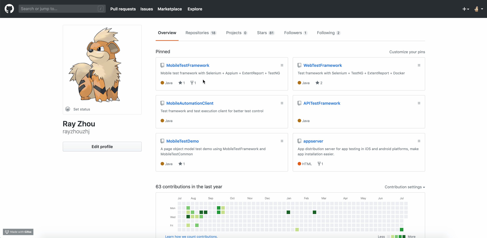

# API-Inspect-Chrome-Extension

## This is an example of 
* Use React to create chrome extension
* Read data from cross origin request
* By pass 'x-frame-options' restriction on iframe

For details, please check out the article here: 
https://medium.com/@ray.zhou.zhj/chrome-extension-handle-request-with-cors-restriction-fb875fee5f3e

